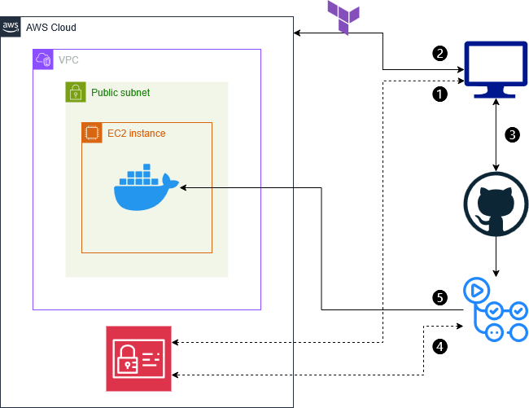

# vuln-infra-lab (infra-v1-ec2 branch)

This branch contains the EC2-based version of a vulnerable infrastructure lab.
It uses [OWASP Juice Shop](https://owasp.org/www-project-juice-shop/) as the target application.

The goal is to simulate a realistic deployment flow using Terraform, EC2, and GitHub Actions, prior to migrating to a fully container-native architecture.

## Features

- Infrastructure provisioning using Terraform
- EC2 instance with Elastic IP and Docker runtime
- Cloud-init–based bootstrap on first boot
- GitHub Actions for CI/CD deployment
- IP-based access control for secure SSH
- Remote deployment script triggered by GitHub Actions

## Deployment flow

1. Local AWS credentials are validated for infrastructure provisioning
2. Terraform provisions infrastructure
3. Code is pushed to GitHub, triggering the deployment workflow
4. GitHub Actions authenticates to AWS using IAM credentials
5. GitHub Actions modifies security group rules, connects via SSH, and runs the containerized application

## Next steps

See the `ecs-migration` branch for the ECS + Fargate version of this project.
